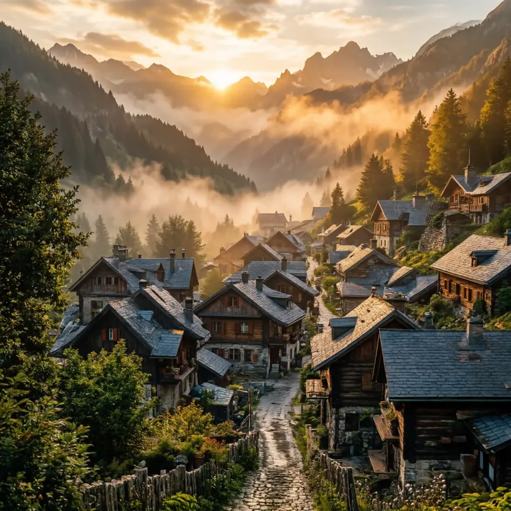
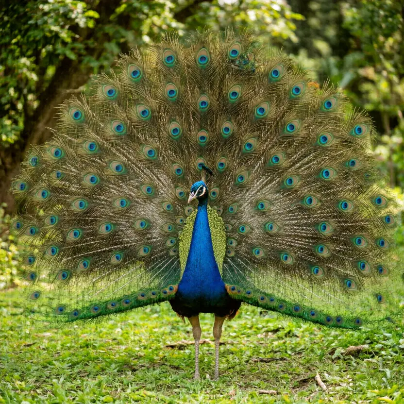
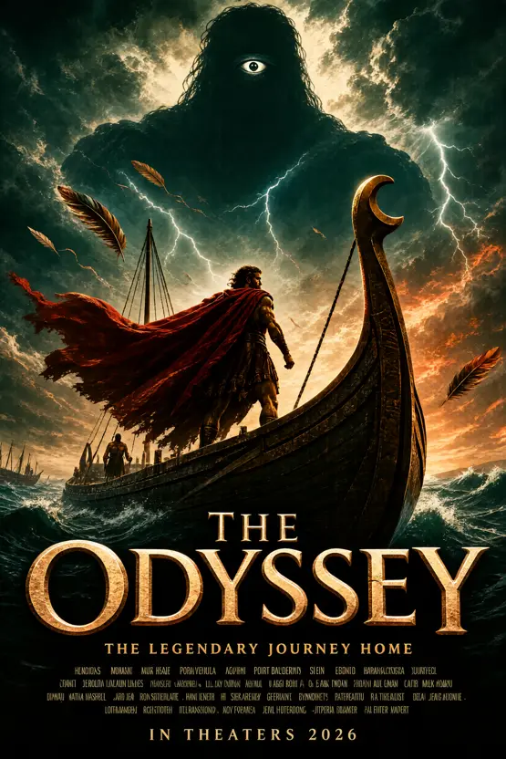

# Validation gallery

The validation-block images below were generated by `scripts/validate.sh` on the reference host (gfx1100, full-stack ROCm 7.14 mode); the poster section at the end came from a separate BLAS-mode run (`logs/posters.log`). Full-resolution originals live in `outputs/validation/` (not committed); each preview links to its receipt in `docs/results/validation/`.

### T2I — mountain village at sunrise (2048×2048, 50 steps, seed 42)

`outputs/validation/t2i-2048.png` — wall 379.6, peak 22.31 GiB — receipt: [t2i.json](../validation/t2i.json), sha256[:12] `9056b6d3ff1d`

### T2I + think — peacock display (2048×2048, reasoning mode)

`outputs/validation/t2i-think.png` — wall 504.6, peak 22.3 GiB — receipt: [t2i-think.json](../validation/t2i-think.json), sha256[:12] `eb6b3adc9ec8` — reasoning text in outputs/validation/t2i-think.think.txt

### Edit — jacket recolored to yellow

`outputs/validation/edit-jacket.png` — wall 460.9, peak 29.9 GiB — receipt: [edit.json](../validation/edit.json), sha256[:12] `671fd6b091da`

### Determinism probe A — lantern in snow (20 steps)

`outputs/validation/determinism-a.png` — receipt: [determinism.json](../validation/determinism.json), sha256[:12] `49e9f9b86160`

### Determinism probe B — byte-identical to A

`outputs/validation/determinism-b.png` — receipt: [determinism.json](../validation/determinism.json), sha256[:12] `49e9f9b86160`

### Interleave — tutorial_image_0.png

`outputs/validation/interleave/tutorial_image_0.png` — wall 3250.5, peak 47.89 GiB — receipt: [interleave.json](../validation/interleave.json), sha256[:12] `6edee105acd3`

### Interleave — tutorial_image_1.png

`outputs/validation/interleave/tutorial_image_1.png` — wall 3250.5, peak 47.89 GiB — receipt: [interleave.json](../validation/interleave.json), sha256[:12] `b6a68a8c0b42`

### Interleave — tutorial_image_2.png

`outputs/validation/interleave/tutorial_image_2.png` — wall 3250.5, peak 47.89 GiB — receipt: [interleave.json](../validation/interleave.json), sha256[:12] `a14610421fe8`

### Interleave — tutorial_image_3.png

`outputs/validation/interleave/tutorial_image_3.png` — wall 3250.5, peak 47.89 GiB — receipt: [interleave.json](../validation/interleave.json), sha256[:12] `182b2856491e`

### Interleave — tutorial_image_4.png

`outputs/validation/interleave/tutorial_image_4.png` — wall 3250.5, peak 47.89 GiB — receipt: [interleave.json](../validation/interleave.json), sha256[:12] `f36b707a9895`

### Interleave — tutorial_image_5.png

`outputs/validation/interleave/tutorial_image_5.png` — wall 3250.5, peak 47.89 GiB — receipt: [interleave.json](../validation/interleave.json), sha256[:12] `233b08e46c98`

### Interleave — tutorial_image_6.png

`outputs/validation/interleave/tutorial_image_6.png` — wall 3250.5, peak 47.89 GiB — receipt: [interleave.json](../validation/interleave.json), sha256[:12] `edce5e778cc6`

### Interleave text — tutorial.txt
text: `outputs/validation/interleave/tutorial.txt` — receipt: [interleave.json](../validation/interleave.json)

### 八仙！ — animated fantasy poster (1664×2496, 50 steps)

`outputs/posters/baxian.png` — wall ~300 s, peak 22 GiB — sha256[:12] `3285c15f5e7c` — prompt+seed in examples/posters-2026-08.jsonl; log docs/results/logs/posters.log

### THE ODYSSEY — epic mythology poster

`outputs/posters/the-odyssey.png` — wall ~300 s, peak 22 GiB — sha256[:12] `389f8f825d49` — prompt+seed in examples/posters-2026-08.jsonl; log docs/results/logs/posters.log

### 功夫女足 — sports comedy poster (regenerated trademark-clean)

`outputs/posters/kungfu-girls.png` — wall ~300 s, peak 22 GiB — sha256[:12] `e890ec0ddaa3` — prompt+seed in examples/posters-2026-08.jsonl; log docs/results/logs/posters.log

### 欢迎来龙餐馆 — fantasy comedy poster

`outputs/posters/dragon-restaurant.png` — wall ~300 s, peak 22 GiB — sha256[:12] `44456ca3e6b6` — prompt+seed in examples/posters-2026-08.jsonl; log docs/results/logs/posters.log
